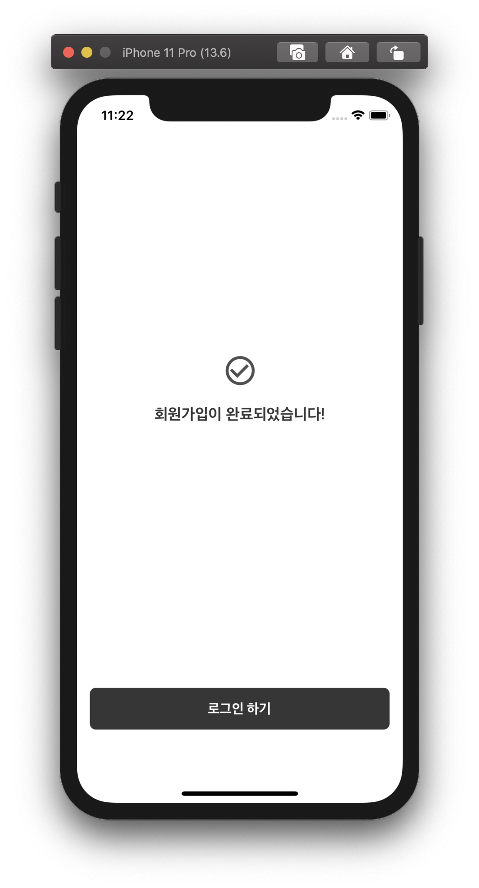

# placepic_iOS 🍎🍏


   

- SOPT 26th APPJAM </b>
- 프로젝트 기간: 2020.06.28 ~ 2020.07.18

---

## 📌 placepic service

<b>우리들끼리 공유하는 최애 장소, 플레이스픽 </b>

플레이스픽은 신뢰있는 커뮤니티 기반의 장소 정보 공유 플랫폼입니다.

Service key Feature

- Exploration - 쉽고, 빠르게 원하는 장소를 탐색
- Discovery - 가보고 싶은 장소를 발견할 수 있어야함
- Interaction - 상호작용, 소통할 수 있는 공간

---

## 💎 Core value

### App Jam Goal

- 우리가 쓸 수 있고, 쓰고 싶은 서비스를 만들어낼 것이다.

### 우리가 추구하는 가치

- 사용자 경험에 대한 집착
- 자기주도성
- 린 스타트업 정신
- PRIDE

---

## ⚙️ 개발 환경 및 사용한 라이브러리

### 💡 개발 환경

> - Xcode 11.5, macOS Catalina 10.15.5
> - CLI : Iterm2 <br>
> - GUI : Gitkraken 7.0.1 <br>

### 💡사용한 라이브러리

**UI**

- `[YPImagePicker]` Multi Photo / Movie Select 라이브러리
- `[SwiftKeychainWrapper]` Userdefault를 대체 - 보안 강화
- `[FSPagerView]` 사진 페이징 라이브러리
- `[XLPagerTabStrip]` 상단 탭바 - Android의 ViewPager
- `[lottie]` 애니메이션 라이브러리

**💡통신**

- `[Alamofire]` Http 통신 라이브러리
- `[Kingfisher]` 사진 통신 라이브러리

<br/>

---

## 💻 placepic's iOS Devleoper

|                                        **🙋 [이유진](https://github.com/lee-yujinn)**                                         |                                        **🙋‍ [이승호](https://github.com/elesahich)**                                         |                                         **🙋‍ [이수진](https://github.com/suzieep)**                                          |
| :---------------------------------------------------------------------------------------------------------------------------: | :---------------------------------------------------------------------------------------------------------------------------: | :---------------------------------------------------------------------------------------------------------------------------: |
|  |  |  |
|                                                          iOS 개발자                                                           |                                                        iOS 리드 개발자                                                        |                                                          iOS 개발자                                                           |
|                          ****                          |                          ****                          |                          ****                          |
|            최애장소 리스트 <br /> 카테고리 필터링 <br /> 그룹 신청대기자 리스트 <br /> 그룹 신청대기자 승인 <br />            |               최애장소 등록 뷰 <br> 업로드 뷰 <br /> 지하철 검색 <br /> 장소 검색 <br /> 키워드 검색 Modal View               |               로그인 <br />이메일 체크<br /> 회원가입 <br /> 내 그룹 리스트 <br />그룹 대기/신청 리스트 <br />                |
|                          ****                          |                          ****                          |                          ****                          |
|                      최애장소 디테일 뷰 <br />최애장소 북마크/좋아요 <br />같이가고싶어요 리스트 <br />                       |                                        랭크 뷰 </br> 마이페이지 뷰 <br /> 웹뷰 <br />                                         |                                             그룹 신청 <br />도입파트 플로우 정리                                              |

---

## 🗝 Code Convention

### 💡 네이밍

- **함수**
  함수 이름은 lowerCamelCase를 사용한다
  함수이름은 동사로 시작한다 ex) `setNavigationBar()`

- **변수**
  변수 이름은 lowerCamelCase를 사용한다

- **상수**
  상수 이름에는 lowerCamelCase를 사용한다

<br />
<br />

### 💡 약어

- 약어는 대문자로 표현한다 ex) userID

  `ViewController` => **VC**
  `TableViewController` => **TV**
  `TableViewCell` => **TVC**

<br />

### 💡 기타 규칙

- self -> 최대한 사용하지 않기
- 함수는 extension에 최대한 정리한다.
- `viewDidLoad()` 에는 함수호출만 하도록 한다.
- `//MARK:` 를 사용해서 연관된 코드를 구분짓습니다.
  <br />

### 💡 git

- git branch

  ```
  master
  |-- develop
    |-- feature/Login
    |-- feature/Home
    |-- feature/PlaceList
    |-- feature/MyPage
  ```

- git commit message rule

  ```
   [Feat] 기능 추가
   [Fix] 버그 수정
   [Refactor] 리팩토링
   [Chore] 간단한 수정
   [Delete] 기능 삭제
   [Docs] 문서
   [Merge] 머지
  ```

---

## 🗂 Foldering

```
placepic
├── Extension
├── HomeScene
│   ├── Home.storyboard
│   ├── Model
│   └── View
├── LoginScene
│   └── View
├── MypageScene
│   ├── Model
│   ├── Mypage.storyboard
│   └── View
├── RankScene
│   ├── Rank.storyboard
│   └── View
├── SearchScene
│   ├── Search.storyboard
│   ├── SubwayTVC.swift
│   └── View
├── Support
│   ├── Assets.xcassets
│   ├── Font
│   └── Info.plist
├── TabbarScene
│   ├── Tabbar.storyboard
│   └── VC
└── WriteScene
    ├── View
    └── Write.storyboard

22 directories, 17 files
```

---

## 📱📲 실행 사진

> ### 0. Login, Signup Scene, Group

          

> ### 1. 장소리스트

   

> ### 2. 디테일 뷰

  

> ### 3. 랭킹


> ### 4. 글쓰기

 

> ### 5. 저장
>
> 

> ### 6. 내 정보


---

## 📈 문제점과 해결방안 report

> ### 1. 사진 Multi Select

문제:

- 커스텀 라이브러리`YPImagePicker`의 사용 제약 조건 - View가 Present 되어야 했다 <br/>
- `ColletionView Cell`에서 띄우는 형태였으므로 present가 불가했다

#### 1차 문제 해결 : `Keywindow` 이용

```swift
  if UIApplication.shared.windows.first(where: { $0.isKeyWindow }) != nil {
      code ~
  }
```

```swift
window?.rootViewController.present(picker, animated: true, completion: nil)
```

위와 같이 `rootViewController`를 채택했다.

2차 문제:

- 글쓰기 탭을 누르면 새로운 뷰가 모달로 새로 떴다.
  그러나 `RootViewController`가 `TabbarController`로 계속 잡혀있어서 View hirachy 에러를 냈다.

`2020-07-17 19:26:45.363807+0900 placepic[39502:7670713] Warning: Attempt to present <YPImagePicker.YPImagePicker: 0x7fd12796a000> on <placepic.TabbarController: 0x7fd12b01ba00> whose view is not in the window hierarchy!`

#### 2차 문제 해결 :

```swift
 func topViewController() -> UIViewController? {
        if let window = UIApplication.shared.windows.first(where: { $0.isKeyWindow }) {
            if var viewController = window.rootViewController {
                while viewController.presentedViewController != nil {
                    viewController = viewController.presentedViewController!
                }
                print("topViewController -> \(String(describing: viewController))")
                return viewController
            }
        }
        return nil
    }
```

- `presentedViewcontroller`를 `TopView`로 만들어주는 함수를 제작했다.
  다음과 같이 사용했다.

```swift
topViewController()?.present(picker, animated: true, completion: nil)
```

> ### 2. 업로드 뷰 - 유용한 장소 정보, 키워드 등
>
> 문제 :

- 고정된 CollectionView Cell의 높이가 변해야 했다.
- Content가 없는 경우 Height 60 > Content가 있는 경우 90으로 변해야 했다.

> ### 3. 모달 키워드 뷰

문제 : 가장 난이도가 높았다.

- label의 width를 받아서 `UIScreen.main.bounds.width`와 비교를 해야 했다.
- `CollectionViewCell`의 좌측 정렬이 필요했다.
- 계속 재사용을 해야 했으며, Selected Index도 받아와야 했다.

  해결 :

#### 1. string의 width 계산

```swift
func width(withConstrainedHeight height: CGFloat, font: UIFont) -> CGFloat {
    let constraintRect = CGSize(width: .greatestFiniteMagnitude, height: height)
    let boundingBox = self.boundingRect(with: constraintRect, options: .usesLineFragmentOrigin, attributes: [NSAttributedString.Key.font: font], context: nil)

    return ceil(boundingBox.width)
}
```

#### 2. `CollectionViewCell`의 좌측 정렬 - `layoutAttributesForElements`을 오버라이딩 했다.

```swift
override func layoutAttributesForElements(in rect: CGRect) -> [UICollectionViewLayoutAttributes]? {
        guard let superAttributes = super.layoutAttributesForElements(in: rect) else { return nil }
        guard let attributes = NSArray(array: superAttributes, copyItems: true) as? [UICollectionViewLayoutAttributes] else { return nil }

        let leftPadding: CGFloat = 10
        let interItemSpacing = minimumInteritemSpacing - 3

        var leftMargin: CGFloat = leftPadding
        var maxY: CGFloat = -1.0
        var rowSizes: [[CGFloat]] = []
        var currentRow: Int = 0
        attributes.forEach { layoutAttribute in
            if layoutAttribute.frame.origin.y >= maxY {
                leftMargin = leftPadding
                if rowSizes.count == 0 {
                    rowSizes = [[leftMargin, 0]]
                } else {
                    rowSizes.append([leftMargin, 0])
                    currentRow += 1
                }
            }
            layoutAttribute.frame.origin.x = leftMargin
            leftMargin += layoutAttribute.frame.width + interItemSpacing
            maxY = max(layoutAttribute.frame.maxY, maxY)
            rowSizes[currentRow][1] = leftMargin - interItemSpacing
        }
        return attributes
    }
```

#### 3. 재사용을 위해 코드로 뷰를 만들었다. (코드 참조)

> ### 4. Git Issue

문제:

- 미숙한 파일링으로 프로젝트가 오류가 난 상태에서 git에 대한 정확한 이해없이 지속적으로 merge를 시도하다가 실패

- 프로젝트가 망가져서 내 local branch와 remote branch의 내용이 일치하지 않아 push도 불가능 <br/>

- 내 branch에서 develop을 pull받을 때 실행파일에서 conflict가 생겨서 둘 다 파일이 xcode에서 열리지 않는 문제 발생

- pull을 받아서 Finder에서 파일이 확인 가능해도 xcode에서는 확인이 파일 확인이 되지 않음

#### 1차 문제 해결 : git hub branch, develop 개념에 대한 정확한 이해, 안전한 파일링 방법으로 브랜치 파일 재정리

- local, remote, stage, merge, fetch, pull, reset 등의 개념을 정확하게 이해하고 문제없는 브랜치를 통해 원래 내 브랜치를 pull받아서 여러 방법으로 복구를 위한 테스트 진행 -> 파일링 문제로 생긴 오류로 판단해 local의 파일이 xcode에서 잘 source control이 되는지 확인 및 수정.

#### 2차 문제 해결 : 내 branch 파일 pull로 살리는 것을 포기하고 직접 project로 import

- git 명령어로만 해결할 수 없는 conflict가 많아서 최종적으로 develop에서 내 branch로 pull 받을 때 실행파일에서 내 branch를 날리고 develop 내용만 받고 내 파일을 하나하나 프로젝트로 복사해 Import하였다.

> 앱잼 초반까지는 메모장에 git 명령어를 순서대로 적어놓고 따라치다가 순서대로 잘 진행이 안되면 다른 팀원에게 물어보는 식으로 많은 부분 의존하면서 사용했는데, 이 오류로 앱잼 총 작업시간 1/2 가까운 시간을 git issue 해결에 투자하면서 git을 사용하는법을 제대로 배울 수 있었고, 협업하기 위한 파일링 관리의 중요성에 대해서 많이 배우는 기회가 되었다.

> ### 5. XLPagerTabStrip Index

- 문제: 카테고리별로 리스트 조회 필터링이 필요
  (카테고리별 해당 인덱스 혹은 페이지 번호를 받아서 쿼리 url에 필터링을 해야함)

  해결: Notification을 사용해 카테고리를 이동할때 childNumber값을 받아 분기처리

  쿼리스트링으로 필터링해서 리스트 정보를 받아옴

```Swift
   var urlString: String = "" //baserURL + 필터링
      if childNumber == "맛집" {
          urlString = "?categoryIdx=1"
      }
      else if childNumber == "술집" {
          urlString = "?categoryIdx=2"
      }
      else if childNumber == "카페" {
          urlString = "?categoryIdx=3"
      }
      else if childNumber == "스터디" {
          urlString = "?categoryIdx=4"
      }
      else if childNumber == "기타" {
          urlString = "?categoryIdx=5"
      }

```

<br/>

> ### 6. **장소정보 태그 StackView + Textfield구현**

- 문제: 장소 키워드/정보 태그 텍스트 길이에 따라 동적으로 크기 변화가 이루어져야함

  해결: 태그 텍스트 길이에 따라 동적으로 크기 변화가 필요해 **StackView안에 Textfield cell을 추가**
  **동적으로 텍스트 길이에 따라 잘 변환됨**
  태그의 개수에 따라 분기처리해서 textfield를 hidden 지정

```swift
if tags.count == 0 { //tag의 개수가 0개일 경우에 따른 코드
            placeListCell.setPlaceInfo(pName: placeListData[indexPath.row].placeName!, pSubway: subwayInfo, pDate: dataInfo, pPhoto: (placeListData[indexPath.row].imageURL?[0])!, pWriter: (placeListData[indexPath.row].user?.profileURL)!, wName: (placeListData[indexPath.row].user?.userName)!, pTag1: "", pTag2: "", pTag3: "")
            placeListCell.placeTag[0].isHidden = true
            placeListCell.placeTag[1].isHidden = true
            placeListCell.placeTag[2].isHidden = true
        }
```

<br/>

> ### 7. **쿼리스트링 다루기**

- 문제: 필터링/ placeIdx/ UserIdx 등 구분을 위해 필요함

  해결: 파라미터에 필터링을 위한 String값을 받아 서버와 연결

```swift
func getlist(_ queryurl: String,completion: @escaping (NetworkResult<Any>) -> Void) {
        print(#function)
        let url = placeListAPI.likelistURL + queryurl
        let header: HTTPHeaders = [
            "token": "token",
            "Content-Type": "application/json"
        ]
        let dataRequest = Alamofire.request(url, method: .get, encoding:JSONEncoding.default, headers: header)

        dataRequest.responseData { dataResponse in
                switch dataResponse.result {
                case .success:
                    guard let statusCode = dataResponse.response?.statusCode else { return }
                    guard let value = dataResponse.result.value else { return }
                    let networkResult = self.judge(by: statusCode, value)
                    completion(networkResult)
                case .failure:
                    completion(.networkFail)
                }
            }
        }

```

<br/>

> ### 8. 오토레이아웃 잡기

- 상세주소가 공백인 경우 장소정보의 Label이 위로 올라가는 상황 발생

- Center Vertically, Less Than or Equal으로 설정했지만 예외적인 상황에서 레이아웃이 망가짐

  차후에 StackView를 활용해 수정할 예정

<br/>

> ### 9. **서버 연결 후 UIView 갱신**

- 문제: TableView, CollectionView의 reloadData()와 같은 데이터 갱신이 UIVIew에서 필요

  해결: viewWillAppear를 override후 서버 success 처리 후 self.viewWillAppear(true) 호출해서 화면 갱신

```
case .success(let place):
                guard let places = place as? DetailModel else { return }
                self.placeDetailData = places
                self.detailImg.reloadData()
                self.viewWillAppear(true)
```

---

## 📋 기능 소개 (기능, 개발여부, 기타 사항)

|            <center>기능</center>             | <center>개발 여부</center> | <center> 담당자 </center> |
| :------------------------------------------: | :------------------------: | :-----------------------: |
|        <center> 이메일 체크 </center>        |    <center> ○ </center>    | <center> 이수진 </center> |
|          <center> 로그인 </center>           |    <center> ○ </center>    | <center> 이수진 </center> |
|         <center> 회원가입 </center>          |    <center> ○ </center>    | <center> 이수진 </center> |
|         <center> 그룹신청 </center>          |    <center> ○ </center>    | <center> 이수진 </center> |
|      <center> 그룹리스트 조회 </center>      |    <center> ○ </center>    | <center> 이수진 </center> |
|         <center> 그룹 신청 </center>         |    <center> ○ </center>    | <center> 이수진 </center> |
|    <center> 그룹 신청 승인/거절 </center>    |    <center> ○ </center>    | <center> 이유진 </center> |
| <center> 마이페이지 유저 정보 조회 </center> |    <center> ○ </center>    | <center> 이승호 </center> |
|   <center> 카테고리 별 태그 조회 </center>   |    <center> ○ </center>    | <center> 이유진 </center> |

|           <center>기능</center>           | <center>개발 여부</center> | <center> 담당자 </center> |
| :---------------------------------------: | :------------------------: | :-----------------------: |
|    <center> 지하철 정보 조회 </center>    |    <center> ○ </center>    | <center> 이승호 </center> |
|     <center> 카테고리 조회 </center>      |    <center> ○ </center>    | <center> 이유진 </center> |
|  <center> 네이버 장소 검색 API </center>  |    <center> ○ </center>    | <center> 이승호 </center> |
|     <center> 장소 조회하기 </center>      |    <center> ○ </center>    | <center> 이유진 </center> |
|     <center> 장소 검색하기 </center>      |    <center> ○ </center>    | <center> 이승호 </center> |
| <center> place 게시물 등록하기 </center>  |    <center> ○ </center>    | <center> 이승호 </center> |
| <center> place 게시물 삭제하기 </center>  |    <center> ○ </center>    | <center> 이유진 </center> |
|      <center> 좋아요 등록 </center>       |    <center> ○ </center>    | <center> 이유진 </center> |
| <center> 좋아요 누른사람 리스트 </center> |    <center> ○ </center>    | <center> 이유진 </center> |

|          <center>기능</center>           | <center>개발 여부</center> | <center> 담당자 </center> |
| :--------------------------------------: | :------------------------: | :-----------------------: |
|      <center> 북마크 등록 </center>      |    <center> ○ </center>    | <center> 이유진 </center> |
| <center> 북마크 한 게시물 조회 </center> |    <center> X </center>    |    <center> </center>     |
|    <center> 상세페이지 조회 </center>    |    <center> ○ </center>    | <center> 이유진 </center> |
|      <center> 좋아요 취소 </center>      |    <center> ○ </center>    | <center> 이유진 </center> |
|      <center> 북마크 취소 </center>      |    <center> ○ </center>    | <center> 이유진 </center> |

---
